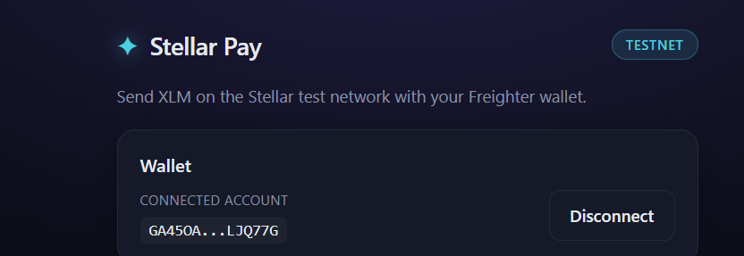
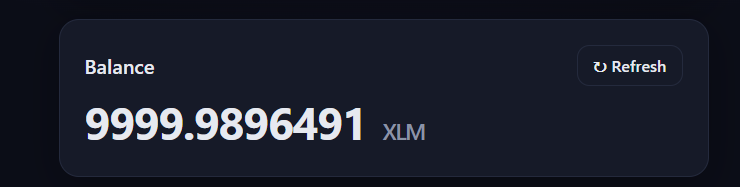
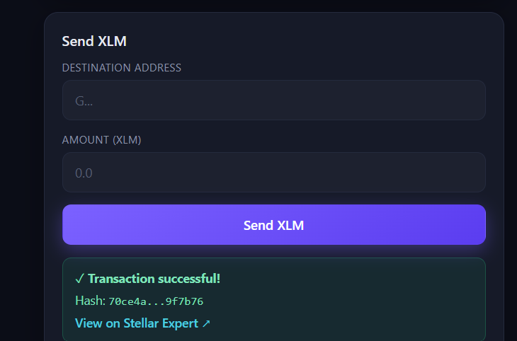

# ✦ Stellar Pay — Testnet XLM Payment dApp

A simple decentralized application for the **Stellar Testnet** that lets you connect a
[Freighter](https://www.freighter.app/) wallet, view your XLM balance, and send XLM
payments to any address — with clear success/failure feedback and a link to the
transaction on a block explorer.

Built for **Level 1 – White Belt** of the Stellar Frontend Challenge.

> **Live demo:** https://stellar-frontend-challenge-beta.vercel.app

---

## ✨ Features

| Requirement | Implemented |
| --- | --- |
| Freighter wallet setup on Testnet | ✅ |
| Connect wallet | ✅ Connect button + approval flow |
| Disconnect wallet | ✅ Clears session state |
| Fetch XLM balance | ✅ Live from Horizon testnet |
| Display balance in UI | ✅ Balance card with refresh |
| Send XLM transaction on testnet | ✅ Address + amount form |
| Transaction feedback (success/failure) | ✅ Colored banners |
| Show transaction hash / confirmation | ✅ Hash + Stellar Expert link |
| Error handling & validation | ✅ Address, amount, balance, network checks |
| Fund testnet account | ✅ One-click Friendbot funding |

## 🛠 Tech Stack

- **React 19 + TypeScript + Vite**
- **[@stellar/stellar-sdk](https://www.npmjs.com/package/@stellar/stellar-sdk)** — build, sign & submit transactions, query Horizon
- **[@stellar/freighter-api](https://www.npmjs.com/package/@stellar/freighter-api)** — wallet connection & signing
- **Horizon Testnet** (`https://horizon-testnet.stellar.org`) + **Friendbot**

---

## 📸 Screenshots

> Replace these placeholders with real screenshots from the running app.

**1. Wallet connected**



**2. Balance displayed**



**3. Successful testnet transaction (result shown to the user)**



---

## 🚀 Getting Started

### Prerequisites

1. **Node.js 18+** and npm.
2. The **[Freighter browser extension](https://www.freighter.app/)** installed.
3. In Freighter, switch the network to **Testnet** (Settings → Network → Test Net).

### Run locally

```bash
# 1. Clone the repo
git clone https://github.com/ahmadgbadeboliss-stack/stellar-frontend-challenge.git
cd stellar-frontend-challenge

# 2. Install dependencies
npm install

# 3. Start the dev server
npm run dev
```

Open the printed URL (default `http://localhost:5173`) in a browser that has Freighter installed.

### Build for production

```bash
npm run build      # outputs to dist/
npm run preview    # preview the production build locally
```

---

## 🧭 How to use

1. Click **Connect Freighter** and approve the connection in the extension popup.
2. Your account address and **XLM balance** appear. If the account is new/unfunded,
   click **Fund with Friendbot** to receive test XLM.
3. In **Send XLM**, paste a destination testnet address (`G...`) and an amount.
4. Click **Send XLM** and approve the transaction in Freighter.
5. On success, a green banner shows the **transaction hash** with a link to view it on
   **Stellar Expert**. On failure, a red banner explains what went wrong.

---

## 📁 Project structure

```
src/
├── lib/
│   ├── freighter.ts   # Wallet: connect, network, sign (Freighter API wrapper)
│   └── stellar.ts     # Balance fetch, payment build/submit, Friendbot funding
├── App.tsx            # UI + state (connect, balance, send, feedback)
├── App.css            # Styles
└── main.tsx           # Entry (Buffer polyfill for stellar-sdk)
```

## 📝 Notes

- This dApp runs **only on the Stellar Testnet** — no real funds are involved.
- Freighter does not expose a true "disconnect" API; **Disconnect** clears the app's
  local session so the UI returns to the connected-wallet prompt.
- If the connected wallet is on the wrong network, the app warns you and disables sending.

## 📄 License

MIT
